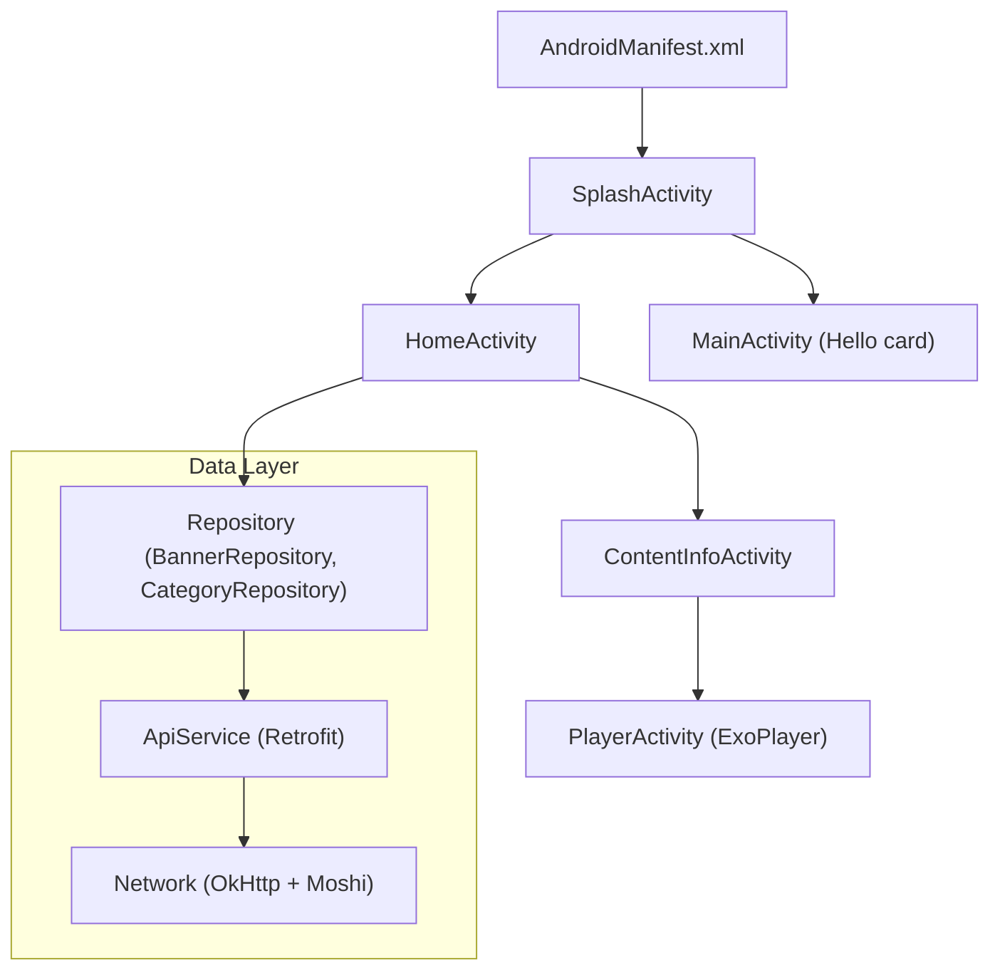

# Android TV App Technical Document

## Project Overview
This Android TV application demonstrates a minimalist, modern TV UI that displays a single “Hello world” card centered on the screen. The app uses a Nord-inspired dark theme and applies Google’s Reddit Sans font to achieve a clean, readable presentation. While the core showcase is the single card, the project also contains additional screens (Login, Home with rails, Content Info, Player) and a small data layer to exemplify structure suitable for a real-world TV app.

Core characteristics:
- Platform: Android TV (Leanback)
- Language and framework: Kotlin with AndroidX, Material 3 (dark), Leanback support
- UI: Single centered card with padding, elevation (shadow), rounded corners
- Theme: Nord dark palette, leveraging Material 3 attributes
- Font: Reddit Sans (bundled TTF), available via res/font
- Networking: Retrofit + OkHttp + Moshi
- Media playback: ExoPlayer (with a Player screen)
- Image loading: Coil
- Minimum SDK: 21, Target SDK: 35

## Architecture
The app follows a modular Gradle setup with three modules:
- app: The Android application module containing Activities, resources, networking layer, repositories, and view models used by the UI.
- list: A small library module with a sample LinkedList implementation used for demonstrating multi-module usage.
- utilities: A utility module that depends on list and provides simple string utilities.

Logical layering inside app:
- UI layer: Activities and view bindings, TV-specific focus handling, and layouts.
- ViewModel layer: Lifecycle-aware state holders for UI screens (e.g., HomeViewModel).
- Data layer: Repositories that coordinate data fetches through Retrofit-based ApiService and map DTOs to domain models using Moshi and simple mappers.

The Hello world screen is implemented in MainActivity together with a layout that centers a MaterialCardView. The Launcher for the app is configured as a SplashActivity that transitions to HomeActivity in the sample, but the single-card MainActivity remains present to illustrate the core requirement.

### High-Level Component Diagram


## Components
- MainActivity (com.example.tv.MainActivity): Displays a single centered card with “Hello world” text. The card is focusable and uses a subtle scale animation on focus and a ripple foreground for TV focus feedback. It navigates to Login on click.
- SplashActivity (com.example.tv.ui.SplashActivity): Shows a splash screen and transitions to HomeActivity.
- HomeActivity + HomeViewModel (com.example.tv.ui.home.*): Demonstrates rails and banner loading for a richer TV experience, including complex focus and D-pad behaviors.
- ContentInfoActivity (com.example.tv.ui.content.ContentInfoActivity): Shows detailed content info with background imagery and action buttons; includes focus logic and image loading via Coil.
- PlayerActivity (com.example.tv.ui.player.PlayerActivity): Media playback using ExoPlayer, configured for TV usage and lifecycle-safe initialization/release.
- Repositories (BannerRepository, CategoryRepository): Retrieve banners and category content via ApiService with fallback data and error handling.
- ApiService (com.example.tv.data.api.ApiService): Retrofit service interface with endpoints for banners, trending, category shows, etc.
- AppConfig (com.example.tv.AppConfig): Centralized configuration (currently API_BASE_URL).
- NetworkConfig: Provides normalized base URL with trailing slash.
- Utilities: ImageCacheUtils (Coil cache/test helpers), list/utilities modules for simple library/demo utilities.

## UI/UX Design
### Nord Dark Theme
The app leverages a Nord-like dark palette defined in res/values/colors.xml and additional Nord resources under res/values. The theme sets:
- Background: nord_bg (#21242A)
- Surface: nord_surface (#2A2E36)
- On-surface text: nord_on_surface (from Nord values files)
- Accent: loader_blue to tint progress indicators

Theme reference (res/values/themes.xml):
```xml
<style name="Theme.TV.NordDark" parent="Theme.Material3.Dark.NoActionBar">
    <item name="android:windowBackground">@color/nord_bg</item>
    <item name="colorSurface">@color/nord_surface</item>
    <item name="colorOnSurface">@color/nord_on_surface</item>
    <item name="colorPrimary">@color/loader_blue</item>
    <item name="android:fontFamily">@font/reddit_sans</item>
    <item name="fontFamily">@font/reddit_sans</item>
    <item name="materialCardViewStyle">@style/Widget.Card.Nord</item>
</style>
```

### Font: Reddit Sans
Reddit Sans font is bundled in res/font:
- res/font/reddit_sans.xml declares the family
- res/font/reddit_sans_regular.ttf is the actual TTF

Snippet (res/font/reddit_sans.xml):
```xml
<font-family xmlns:app="http://schemas.android.com/apk/res-auto">
    <font
        app:font="@font/reddit_sans_regular"
        app:fontStyle="normal"
        app:fontWeight="400" />
</font-family>
```

### Single Centered Card
The Hello world card is a MaterialCardView centered using ConstraintLayout. It uses rounded corners, subtle elevation, focus ripple, and scales slightly when focused to provide TV-friendly feedback.

Layout excerpt (res/layout/activity_main.xml):
```xml
<com.google.android.material.card.MaterialCardView
    android:id="@+id/helloCard"
    style="@style/Widget.Card.Nord"
    android:layout_width="0dp"
    android:layout_height="wrap_content"
    app:layout_constraintWidth_min="360dp"
    app:layout_constraintWidth_max="720dp"
    app:layout_constraintTop_toTopOf="parent"
    app:layout_constraintBottom_toBottomOf="parent"
    app:layout_constraintStart_toStartOf="parent"
    app:layout_constraintEnd_toEndOf="parent"
    android:foreground="@drawable/tv_focus_ripple"
    app:contentPadding="16dp">

    <TextView
        android:id="@+id/titleText"
        style="@style/TextAppearance.Card.Title"
        android:text="@string/hello_world"
        android:gravity="center"
        android:contentDescription="@string/hello_world"/>
</com.google.android.material.card.MaterialCardView>
```

### Accessibility and TV Best Practices
- D-pad focusability: The card is fully focusable with isFocusable and isFocusableInTouchMode set. Focus requests guide initial focus for a predictable TV experience.
- Focus feedback: Uses ripple foreground and a small scale animation on FocusChange. Elevation and stroke also help indicate focus.
- Readability: Reddit Sans at a large size (e.g., TitleLarge) against high-contrast colorOnSurface ensures clear legibility at TV viewing distances.
- Content descriptions: Strings include contentDescription values for images and cards to aid accessibility tooling.
- Safe areas and margins: The card uses ample padding and constrained width to read well from a distance.
- No touch requirements: The manifest disables touchscreen requirement (uses-feature touchscreen false) and requires Leanback.

## Build and Run Instructions
Prerequisites:
- Android Studio (Giraffe or newer) or Gradle wrapper
- Android SDK installed; JDK 17

Build via command line at project root (hello-world-android-tv-91585/android_tv_frontend):
- Debug build: ./gradlew assembleDebug
- Or use provided script: ./build.sh [--clean]

Install on an emulator or device:
- adb install -r app/build/outputs/apk/debug/app-debug.apk

Run:
- From Android TV launcher, select the app banner. The launcher activity is SplashActivity which navigates; you can also start MainActivity manually for the single-card demo.

## Project Structure
- settings.gradle: includes app, list, utilities modules
- build.gradle (root): Gradle plugin versions and repositories
- app/
  - src/main/AndroidManifest.xml: TV features, launcher, activities, theme
  - java/com/example/tv/:
    - MainActivity.kt: Hello world card screen
    - TVApp.kt: Application class
    - AppConfig.kt: Config constants
    - ui/: SplashActivity, login, home, content, player
    - data/: repositories and api (Retrofit)
  - res/: values (themes, colors, strings), layout (activity_main.xml), font (reddit_sans)
- list/: org.example.list.LinkedList
- utilities/: string utilities built atop list

## Dependencies
Declared in app/build.gradle:
- AndroidX core, appcompat, constraintlayout, activity-ktx
- Material: com.google.android.material:material
- Leanback: androidx.leanback:leanback
- Networking: Retrofit, OkHttp, Moshi
- Coroutines: kotlinx-coroutines-android/core
- Lifecycle: viewmodel-ktx, runtime-ktx
- Image loading: Coil
- Media: ExoPlayer (exoplayer, exoplayer-ui)
- Testing: JUnit, AndroidX test and Espresso

Example fragment:
```groovy
implementation "androidx.leanback:leanback:1.1.0-rc02"
implementation "com.squareup.retrofit2:retrofit:2.11.0"
implementation "com.google.android.exoplayer:exoplayer:2.19.1"
implementation "io.coil-kt:coil:2.6.0"
```

## Configuration
- AppConfig.API_BASE_URL (com.example.tv.AppConfig) holds the backend base URL:
```kotlin
object AppConfig {
    const val API_BASE_URL: String = "https://25942d6e.api.kavia.app/"
}
```
- .env: Currently not used by the Android module; container_env is empty.
- NetworkConfig ensures trailing slash normalization for the base URL.

To change API URL:
- Update AppConfig.API_BASE_URL and rebuild.

## Testing Strategy
- Unit tests example: FocusMappingTest in app/src/test validates D-pad focus index mapping between rows and bounds clamping.
- UI tests: Can be added via Espresso to validate focus and navigation; not currently included beyond dependencies.
- ViewModel tests: For HomeViewModel, use coroutines TestDispatcher and fake repositories to validate state flows.

Recommended additions:
- Robolectric tests for Activity layout behaviors on TV
- Instrumentation tests for D-pad navigation across rails and cards

## Code Quality
- Kotlin style: official (gradle.properties sets kotlin.code.style=official)
- Gradle modules encourage separation of concerns and faster builds.
- Use of ViewBinding: enabled via buildFeatures.viewBinding for safer view access.
- Strict typing and DTO mappers reduce UI coupling to wire formats.
- ProGuard/R8 rules present (proguard-rules.pro); minify disabled for debug and release currently.

## Security Considerations
- Network security: Uses HTTPS for API_BASE_URL. Ensure certificates are valid; avoid cleartext.
- Secrets: No secrets or tokens are embedded. If added later, use BuildConfig fields, Gradle properties, or Android Keystore for sensitive values.
- Web requests: Add timeouts and interceptors (already using OkHttp logging for debugging; disable in release builds).
- ExoPlayer: Validate and sanitize media URLs; avoid arbitrary file paths.

## Performance on TV Devices
- Layout: Single card and minimal overdraw with a dark background; elevation kept moderate to reduce GPU cost.
- Images: Coil used lazily; larger screens need correct size hints for optimal caching.
- Networking: Retrofit and Moshi are efficient; consider response caching and pagination for content-heavy screens.
- ExoPlayer: Use hardware-accelerated codecs on TV; release player aggressively on pause/stop; keep screen-on flags for playback as needed.
- Focus navigation: Simple focus hierarchy in MainActivity; HomeActivity implements efficient index mapping to reduce focus thrash.

## Logging and Monitoring
- Use Logcat for debugging during development; add structured logging wrappers if needed.
- OkHttp logging-interceptor is included; disable or reduce level for release builds.
- For crashes/analytics, integrate Crashlytics or a similar tool in future enhancements.

## Future Enhancements
- Convert single-card Hello screen to a composable or Leanback BrowseSupportFragment sample to show extensibility.
- Introduce proper DI (e.g., Hilt) for repositories and services.
- Add paging for content lists and image prefetch for faster banner rendering.
- Introduce theming toggles (Nord variants, accent customization) and dynamic font scale for accessibility.
- Implement robust instrumentation tests for D-pad navigation and focus behaviors across the app.
- Add configuration management via BuildConfig fields or Gradle flavors (dev/stage/prod) for API endpoints.

## Concise Code Samples
MainActivity focus and navigation:
```kotlin
binding.helloCard.apply {
    isFocusable = true
    isFocusableInTouchMode = true
    requestFocus()
    setOnClickListener {
        startActivity(Intent(this@MainActivity, LoginActivity::class.java))
    }
    setOnFocusChangeListener { v, hasFocus ->
        v.animate().scaleX(if (hasFocus) 1.03f else 1.0f)
            .scaleY(if (hasFocus) 1.03f else 1.0f)
            .setDuration(120)
            .start()
    }
}
```

Retrofit creation (ApiService factory simplified overview):
```kotlin
val okHttp = OkHttpClient.Builder()
    .addInterceptor(HttpLoggingInterceptor().apply { level = BASIC })
    .build()

val retrofit = Retrofit.Builder()
    .baseUrl(NetworkConfig.baseUrl())
    .addConverterFactory(MoshiConverterFactory.create())
    .client(okHttp)
    .build()

val api = retrofit.create(ApiService::class.java)
```

Theme shape and card style (themes.xml):
```xml
<style name="Widget.Card.Nord" parent="Widget.Material3.CardView.Elevated">
    <item name="cardBackgroundColor">@color/nord_surface</item>
    <item name="cardElevation">8dp</item>
    <item name="strokeColor">@color/nord_unfocused_stroke</item>
    <item name="strokeWidth">1dp</item>
    <item name="shapeAppearance">@style/ShapeAppearance.Medium.Rounded</item>
</style>
```

## Build/Run Quick Reference
- Build: ./gradlew assembleDebug or ./build.sh
- Install: adb install -r app/build/outputs/apk/debug/app-debug.apk
- Launch: From TV home; initial launcher is SplashActivity. Open MainActivity to view the Hello card.

---
Document owner: DocumentationAgent
